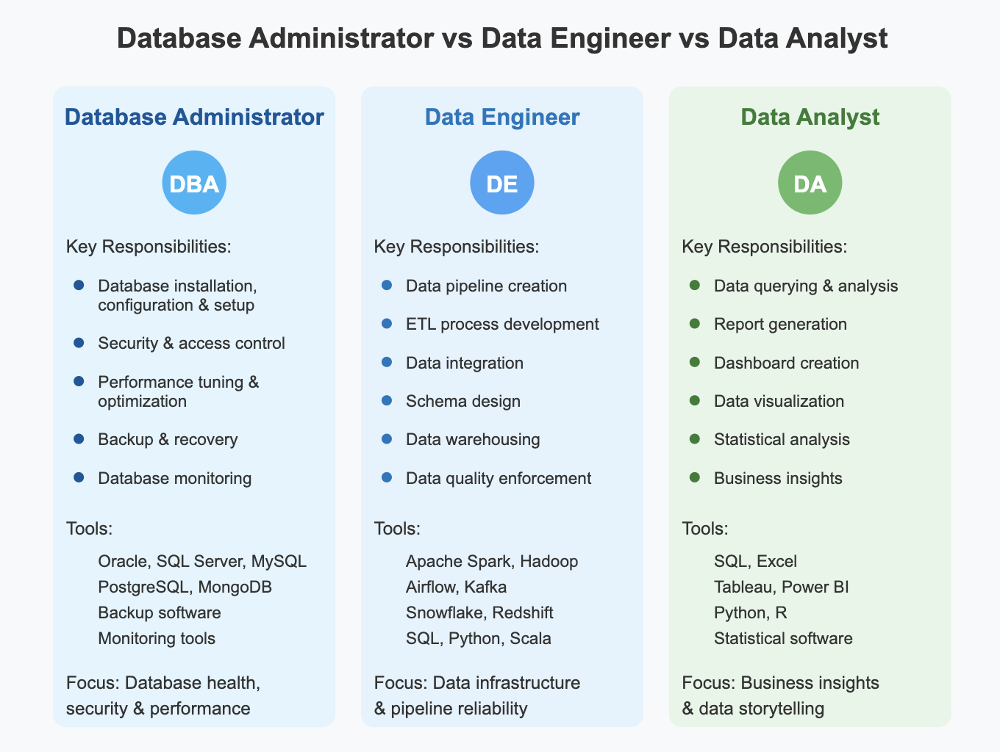

Die Menge an Daten, die jeden Tag von jeder Organisation erzeugt wird, wächst seit einigen Jahren stetig. Es gibt viele Rollen, die an der Verwaltung, Kontrolle und Nutzung dieser Daten beteiligt sind. Schauen wir uns die drei Rollen im Datenbereich an, die heutzutage in den meisten Organisationen üblich sind:

- Datenbankadministrator: Ein Datenbankadministrator ist dafür verantwortlich, die Datenbanken einer Organisation zu verwalten, zu pflegen und abzusichern. Er ist verantwortlich für die Integrität der Daten. Außerdem ist er für die Performance zuständig und setzt Sicherheitsmaßnahmen um, um sensible Informationen zu schützen. Er arbeitet eng mit Entwicklern und IT-Teams zusammen, um den Geschäftsbetrieb zu unterstützen.

- Data Engineer: Ein Data Engineer entwirft, baut und pflegt Datenpipelines und Architekturen, die die effiziente Erfassung, Speicherung und Verarbeitung großer Datensätze ermöglichen. Er nutzt SQL, Apache Spark und Cloud-Plattformen, um sicherzustellen, dass der Datenfluss von verschiedenen Quellen zu den Datenbanken und Analysesystemen reibungslos verläuft. Er stellt sicher, dass die Daten, die Data Analysts erhalten, sauber und verlässlich sind.

- Data Analyst: Ein Data Analyst untersucht und interpretiert Daten, um Erkenntnisse zu gewinnen, die Unternehmen bei fundierten Entscheidungen helfen. Er erstellt Berichte und Dashboards mit Tools wie Excel, Power BI oder Tableau. Er hilft Organisationen dabei, Trends zu erkennen, die Leistung zu messen und datenbasierte Erkenntnisse bereitzustellen.

Im Bild unten seht ihr weitere Details zu jeder Rolle sowie einen Vergleich.

