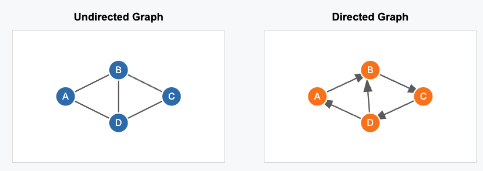
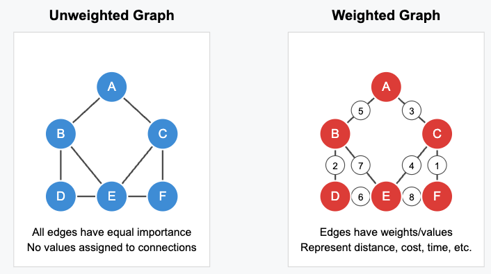

Habt ihr schon einmal Google Maps genutzt, jemandem auf Instagram gefolgt oder in Wikipedia gestöbert? Dann hattet ihr bereits mit Graphen zu tun – auch wenn es euch vielleicht nicht bewusst war!

Graphen helfen uns, Beziehungen und Verbindungen in der realen Welt zu modellieren, von sozialen Netzwerken über Stadtpläne bis hin zu komplexen Empfehlungssystemen.

Ein Graph ist eine Sammlung von Knoten (auch Vertices genannt) und Kanten (Verbindungen zwischen Knoten). Mathematisch lassen sich Graphen wie folgt definieren:

> Ein Graph ist ein Paar $G = (V, E)$, wobei $V = \text{Knoten (oder Vertices)}$ und $E \subseteq V \times V = \text{Kanten}$.

Die Kanten eines Graphen können ungerichtet oder gerichtet sein, wie unten zu sehen ist:

Im obigen ungerichteten Graphen ist es möglich, nicht nur von $A \rightarrow B$ zu gehen, sondern auch von $B \rightarrow A$. Im obigen gerichteten Graphen können wir jedoch nur von $A \rightarrow B$ gehen, es gibt aber keinen direkten Weg von $B$ nach $A$.

Graphen können als Adjazenzmatrix $A$ dargestellt werden, wobei die Einträge $a_{ij}$ genau dann 1 sind, wenn es eine Kante von $V_i \rightarrow V_j$ gibt. Ein Beispiel für eine Adjazenzmatrix für die beiden obigen Graphen ist unten zu sehen:

$$
A_{ungerichtet} = \begin{pmatrix}
0 & 1 & 0 & 1 \\
1 & 0 & 1 & 1 \\
0 & 1 & 0 & 1 \\
1 & 1 & 1 & 0
\end{pmatrix}
$$

> Ungerichtete Graphen sind symmetrisch.

$$
A_{gerichtet} = \begin{pmatrix}
0 & 1 & 0 & 0 \\
0 & 0 & 1 & 0 \\
0 & 0 & 0 & 1 \\
1 & 1 & 0 & 0
\end{pmatrix}
$$

Eine andere Möglichkeit, Graphen zu betrachten, besteht darin, den Kanten Gewichte zuzuweisen. In diesem Fall werden nicht alle Kanten gleich behandelt. Betrachten wir zum Beispiel den Graphen als Straßennetz. Nicht jede Straße hat die gleiche Länge, sodass wir bei der Berechnung der Zeit, die wir benötigen, um von einem Punkt zum anderen zu gelangen, die Längen der einzelnen Kanten (Straßen) berücksichtigen müssen, denen wir auf unserer Reise begegnen könnten.

__Warum sind Graphen wichtig?__
Graphen sind überall. Sie helfen, viele Probleme zu lösen, wie zum Beispiel:
- den kürzesten oder schnellsten Weg zwischen zwei Punkten,
- Konnektivität – kann jeder in einem Netzwerk erreicht werden,
- Empfehlungssysteme – was solltet ihr als Nächstes kaufen, wem solltet ihr als Nächstes folgen.

Sie werden in Suchmaschinen, Logistik und Transport, Biologie, Chemie und künstlicher Intelligenz eingesetzt.

Graphen sind wirklich interessant und können verwendet werden, um viele verschiedene Dinge darzustellen. Zum Beispiel haben wir die [Wetter-Markov-Kette](./../markovian-property-and-markov-chain) in meinem vorherigen Blogbeitrag als gewichteten Graphen dargestellt, bei dem die Übergangswahrscheinlichkeiten zwischen den Zuständen das Gewicht der Kanten waren. Auch verborgene Markov-Modelle können in Form von Graphen dargestellt werden.

Wir werden uns Graphalgorithmen in einem zukünftigen Beitrag genauer ansehen.
