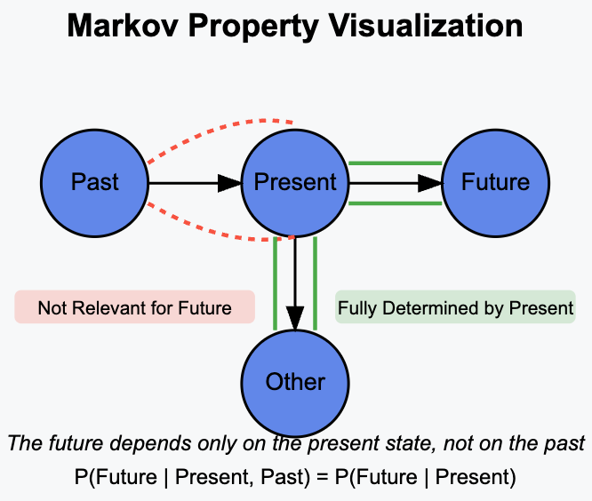
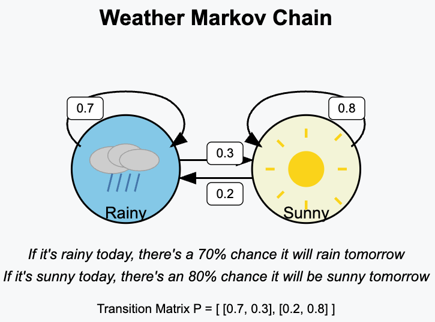

Im Bereich des Reinforcement Learning (RL) gibt es ein großes Interessensgebiet, nämlich Markov-Entscheidungsprozesse (Markov Decision Processes, MDPs). Bei MDPs interessieren wir uns für Prozesse, die die Markov-Eigenschaft besitzen.

Im RL haben wir einen Agenten, der sich von Zuständen $S_t$ durch Ausführen von Aktionen $a_t$ zum Zeitpunkt $t$ in einen anderen Zustand $S_{t+1}$ bewegt. Einfach ausgedrückt ist das Ziel des Agenten, seine zukünftigen Belohnungen zu maximieren. Das bedeutet, er möchte diejenigen Aktionen ausführen, die im Erwartungswert zu besseren Belohnungen führen.

Um solche Prozesse zu entwerfen, müssten wir die Wahrscheinlichkeit bestimmen, sich im Zustand $S_{t+1}$ zu befinden, gegeben alle vorherigen Zustände. Ohne Markov-Eigenschaft würde das mathematisch wie folgt aussehen:

$$
p(S_{t+1} | S_t, S_{t-1}, S_{t-2}, \dots, S_0)
$$

Wir sehen nun, dass wir die vollständige Liste der Zustände verfolgen müssten, in denen sich der Agent befunden hat, was das Modelldesign sehr kompliziert machen könnte. Dies lässt sich vereinfachen, wenn die Prozesse die Markov-Eigenschaft besitzen.

> Die Markov-Eigenschaft besagt, dass der zukünftige Zustand eines Prozesses nur vom gegenwärtigen Zustand abhängt und nicht davon, wie man dorthin gelangt ist (d. h. den vergangenen Zuständen). Daraus folgt:

$$
p(S_{t+1} | S_t, S_{t-1}, S_{t-2}, \dots, S_0) = p(S_{t+1} | S_t)
$$

Das obige Bild zeigt, dass das System vom gegenwärtigen Zustand aus in einen zukünftigen oder anderen Zustand übergehen kann, was vollständig vom gegenwärtigen Zustand abhängt und unabhängig von den vergangenen Zuständen ist.

Das macht den Prozess gedächtnislos – nur der aktuelle Zustand ist relevant, um den nächsten vorherzusagen. Wie der Agent den aktuellen Zustand erreicht hat und welche Schritte er bisher unternommen hat, ist für den nächsten Schritt nicht relevant.

__Bedeutung der Markov-Eigenschaft__
- Sie vereinfacht die Modellierung des Prozesses – wir müssen lediglich den aktuellen Zustand verfolgen.
- Sie bildet die Grundlage für Markov-Ketten, die wir oben bereits ein wenig betrachtet haben.
- Sie führt zu effizienten Berechnungen.

__Beispiele__
- Bei einem Brettspiel wie Monopoly hängt eure nächste Position nur von eurer aktuellen Position und dem Würfelwurf ab. Es spielt keine Rolle, wie ihr an diese Position gelangt seid. Das macht es Markovsch.
- Der Weg von einer Bahnstation zur nächsten hängt nur von der aktuellen Bahnstation ab. Wie wir zur aktuellen Bahnstation gelangt sind, ist für die Planung, wohin wir als Nächstes gehen können, nicht relevant.

Schauen wir uns abschließend eine Markov-Kette an.
> Eine Markov-Kette ist ein mathematisches Modell, das eine Abfolge möglicher Ereignisse beschreibt, bei denen die Wahrscheinlichkeit jedes Ereignisses nur vom aktuellen Zustand abhängt und nicht von der Abfolge der Ereignisse, die ihm vorausgegangen sind.

__Bestandteile einer Markov-Kette__
- Zustände. Alle möglichen Situationen, in denen sich das System befinden kann.
- Übergangswahrscheinlichkeiten. Die Wahrscheinlichkeit, von einem Zustand in einen anderen zu wechseln.
- Ausgangszustand. Wo der Prozess beginnt.

Schauen wir uns diese Bestandteile anhand eines Beispiels an:

Was wir im Bild sehen, ist ein System von Wetteränderungen. Wir haben zwei mögliche Zustände, in denen sich das System befinden kann: Regnerisch oder Sonnig. Zusätzlich sehen wir die Übergangsmatrix, die wie folgt geschrieben werden kann:

$$
P = 
\begin{pmatrix}
 & \text{Regnerisch} & \text{Sonnig} \\
\text{Regnerisch} & 0.7 & 0.3 \\
\text{Sonnig} & 0.2 & 0.8
\end{pmatrix}
$$

Der Ausgangszustand könnte regnerisch oder sonnig sein, das spielt für dieses Beispiel keine Rolle.

Zusammenfassend ist eine Markov-Kette eine Möglichkeit, Systeme zu modellieren, die sich probabilistisch zwischen Zuständen bewegen. Sie folgt der Markov-Eigenschaft: Die Zukunft hängt nur von der Gegenwart ab, nicht von der Vergangenheit. Sie sind überall zu finden – von Web-Algorithmen über das Wetter bis hin zu Finanzen, zum Beispiel bei Google PageRank oder der Modellierung von Kreditratings.

### Referenzen
1. [Markov-Eigenschaft auf Wikipedia](https://en.wikipedia.org/wiki/Markov_property)
