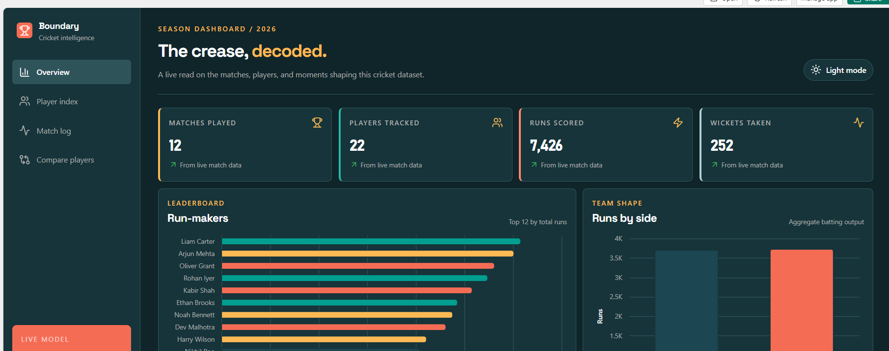
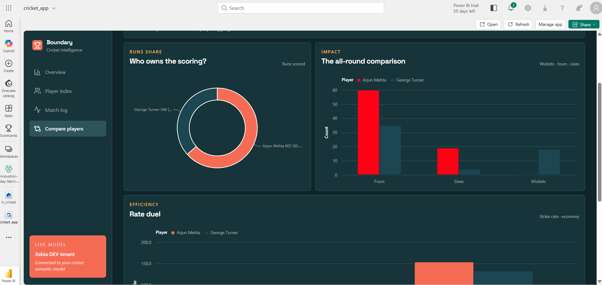
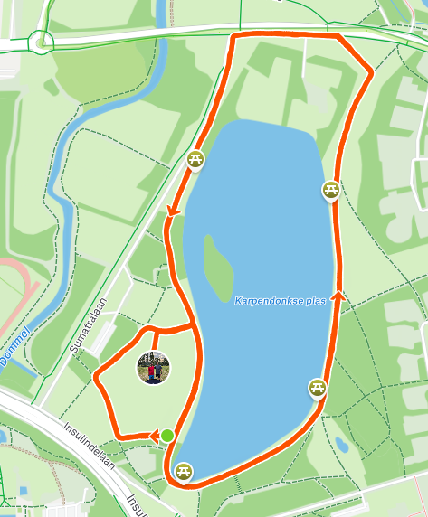

**Event dates:** 24–26 September 2026 · Eindhoven, Netherlands

Like every quarter, the whole company met again, this time in the beautiful city of Eindhoven in the Netherlands. It was two days full of fun, innovation, and the opportunity to spend time together in person.

## Meeting the team

I travelled from my city to Eindhoven by DB on Thursday. As was expected the trains were all delayed, so the journey took longer than expected, but I still made it to Eindhoven for the start of the event.

We started with a team dinner on Thursday evening. The food was great, but what was even better was meeting all my colleagues again after almost three months. We had a really good time together.

As I usually do, I started Friday with a short run through the city. Afterwards, I had breakfast with my colleagues before heading to the High Tech Campus. In the conference room, we joined colleagues from Belgium and the Netherlands to start the Innovation Day.

More than 70 people from Belgium, the Netherlands, and Germany joined this time. It was great to meet colleagues in person after having worked with some of them only through Teams.

## Building with Fabric Apps

My topic for the Innovation Day was Fabric Apps, which is still in preview. I wanted to get some hands-on experience with this new feature in Microsoft Fabric.

After some initial problems getting the Fabric capacity running in our new development tenant, it was relatively easy to start working on the idea. I have the feeling that Microsoft is slowly moving back towards high-code development. Maybe this is because it is easier to train agents to create high-code solutions than low-code ones? It is an interesting question, and one that I expect to explore more in the future.

As always, I used cricket data to see what I could build in the remaining hours. Once the initial setup was complete, it was easy to use an agent to create the visuals I had in mind.

I will share more details about the application and the technical side in a future post.

## Dinner and an evening together

In the evening, the whole team went to dinner together. We had a great time eating, drinking, and playing the games available at the venue.

## Running before the journey home

On Saturday, some colleagues joined a social run. We had a short run full of conversations, which was a great way to spend time together outside the conference room.

That was not the end of my running for the day. I wanted to visit the Eindhoven parkrun, but my return train was at 10:19. This left me roughly one hour to complete the 5 km parkrun, run the 2.5 km back to the hotel, take a shower, and get to the train station in time.

So I had to run not only the parkrun itself, but also the route to and from it. Tobias joined me for all the runs on Saturday, and we had a lot of fun. Hopefully, we will be able to do it again.

All five runs from Friday and Saturday are linked to this article in the [2026 run archive](/runs/2026/).

The return journey to my city was also by train, and as soon as we entered Germany all the trains were delayed as well. After the early start and the rush to the station, the delay added one more unexpected part to the journey home.

It was a busy two days, but also a very enjoyable Innovation Day. Meeting colleagues, experimenting with new technology, and fitting in a few runs made it a memorable trip.
